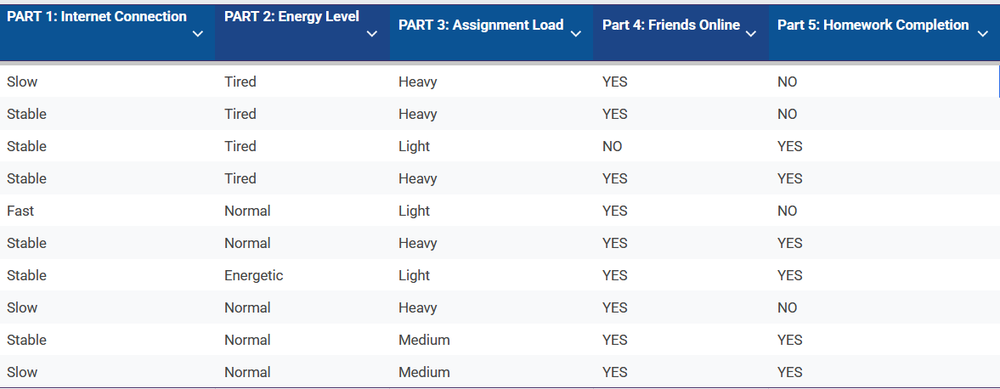
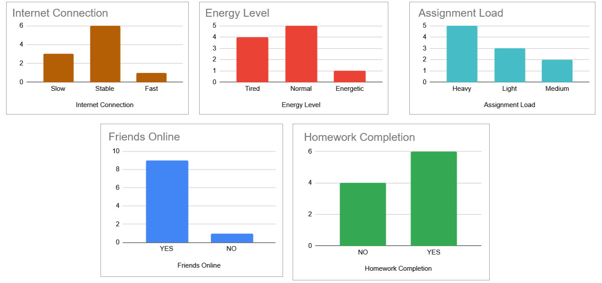
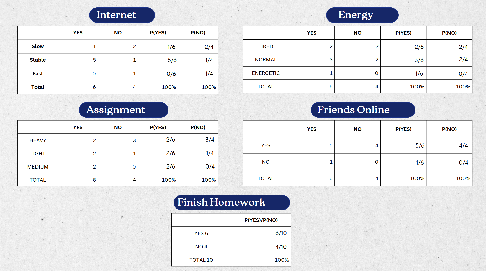
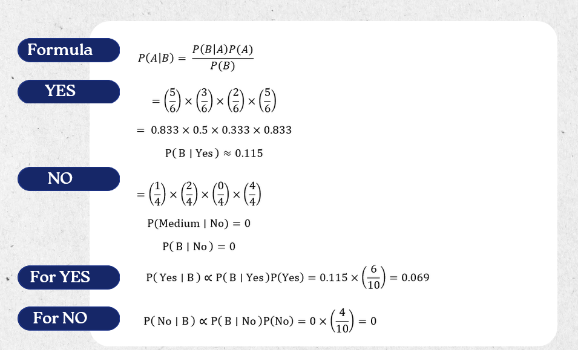
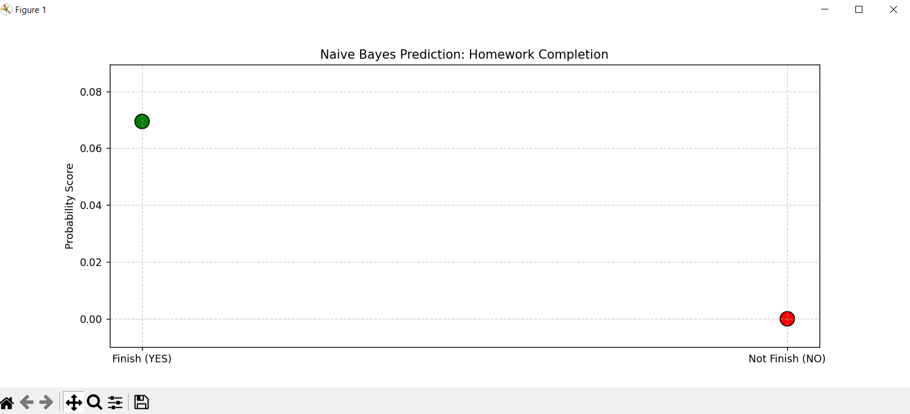

# Naive-Bayes-StudentGamer-Homework-Predictor
 Analyze how gaming-related factors influence whether students finish their homework.  
 
## The Survey Structure
We collect data across four key dimensions to predict the likelihood of homework completion.

| Feature | Variable | Options |
| :--- | :--- | :--- |
| **Internet** | Connection Quality | Slow, Stable, Fast |
| **Energy** | Physical State | Tired, Normal, Energetic |
| **Workload** | Assignment Volume | Light, Medium, Heavy |
| **Social** | Friends Online | Yes, No |
| **Target** | **Completion** | **Yes, No** |

## Raw Data Collection
We collected 10 initial samples to observe the relationship between a student's environment and their homework completion.

## Data Distribution 
These charts show the frequency of responses across our four main features. 
* Most students reported a **Stable** internet connection.
* **Heavy** assignment loads were the most common.
* **Friends being online** (YES) is a dominant factor in this dataset.

## Probability Tables (Likelihood)
Using the Naive Bayes algorithm, we converted the counts into likelihood probabilities. This allows us to see how much each factor "weighs" toward a YES or NO outcome for homework completion.

## Mathematical Calculation
To predict a new scenario, we apply Bayes' Theorem:
$$P(A|B) = \frac{P(B|A) \cdot P(A)}{P(B)}$$

Below is the manual calculation for a student with **Stable Internet, Normal Energy, Medium Workload, and Friends Online**:

> **Observation:** In our "NO" calculation, the probability dropped to **0** because some category combinations had no data points. 

## Final Prediction Result
The final probability score shows a clear winner. Based on the data, a student in this specific scenario has a much higher probability of finishing their homework.

